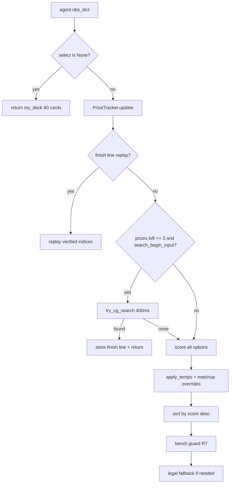

# Starmie / Froslass — resources & how to use

**Status:** Deck + rule pilot in-repo. **Not** a Finals candidate (Archaludon **1196.1 μ** is leader). Use for field opponent, Strategy report, and future bootstrap from gold-medal source.

---

## External resources (canonical links)

| Resource | URL / author | What it is | Use for |
|----------|--------------|------------|---------|
| **Gold Medal write-up** | masamikobayashi — *Prize Card Tracking* (Kaggle write-up / forum) | Explains **PrizeTracker**, Finish search, rule modes | `agent/prize_tracker.py` design; deck-search NOMATCH fix |
| **Gold Medal notebook** | [Prize Card Tracking: 1300+ Starmie](https://www.kaggle.com/code/masamikobayashi/prize-card-tracking-1250-starmie) | **Rule-based** Starmie/Froslass agent + ashleysandlin deck | **Bootstrap target** — copy `main.py` / scoring cells here |
| **Source deck** | [ashleysandlin @ Limitless](https://play.limitlesstcg.com/tournament/69e4f71948d465883f718047/player/ashleysandlin/decklist) | Tournament Starmie/Froslass list | `agent_decks/starmie_froslass_ashleysandlin.csv` |
| **Competition sim data** | [pokemon-tcg-ai-battle](https://www.kaggle.com/competitions/pokemon-tcg-ai-battle) | `EN_Card_Data.csv`, sample submission, `cg/` engine | Local copy: `data/sim/sample_submission/` |
| **ML starter notebook** | *(unrelated — RandomForest + Lucario)* | sklearn on **mock** replays; default deck `678` | **Do not use for Starmie** — wrong deck, wrong brain |

### Gold Medal agent architecture (from write-up)

1. **Generic mode** — default scoring (setup, attach, evolve, attack).
2. **Matchup modes** — Lucario, Iono, Crustle, etc. priority shifts.
3. **Finish mode** — forward search when a winning line may exist; replay verified sequence.
4. **PrizeTracker** — conservative prize inference during Hilda/Salvatore deck search (`obs.select.effect` for in-flight cards).

**Rule:** Normal turns = rules. Winning turns = verified search. Wrong prize inference is worse than none.

---

## Rule pilot — how decisions are made (`agent/starmie_agent.py`)

This is the **in-repo rule brain**. Every turn: score each legal option, pick highest score (tie-break: higher index). Never infer legality from card text — only from `obs.select.option` (R7).

### Decision flow



### Hard rules (never break)

| Rule | When | Action |
|------|------|--------|
| **Empty bench** | MAIN + END + bench empty + basic/Poffin in hand | Score END **−50000**; must bench first |
| **Jetting tempo** | Mega Starmie ex active + ≥1 energy + MAIN + END | Score END **−50000**; must attack Jetting Blow |
| **Tempo cap** | Jetting live + MAIN + PLAY/ATTACH/EVOLVE (not Boss/lethal play) | Cap score at **5000** — do not draw instead of attacking |
| **Prized deck pick** | TO_HAND / TO_DECK search | **−1e9** if `PrizeTracker.is_prized(card_id)` |
| **Bench guard** | Any selection | `starmie_bench_guard` keeps ≥1 Basic on bench when legal |
| **Legal fallback** | Crash or illegal indices | Return first `minCount` option indices |

### Setup phase

| Context | Rule |
|---------|------|
| MULLIGAN | Prefer **NO** (keep hand) — score 10000 |
| IS_FIRST | Prefer **NO** (go second) — score 10000 |
| SETUP_ACTIVE | Staryu **20000**, Snorunt **15000** |
| SETUP_BENCH | Staryu **20000**, Snorunt **12000**; other basics **−10000** |

### Generic MAIN — play priority (representative scores)

Higher = more likely. Jetting-live rows are capped by tempo unless noted.

| Card / action | Score | Notes |
|---------------|------:|-------|
| Staryu (empty bench) | 50000 | R7 bench fill |
| Poffin (empty bench) | 50000 | Same |
| Wally on wounded mega | 16000 | Heal Starmie/Froslass ex |
| Poffin (bench space) | 15000 | |
| Mega Signal | 14000 | **5000** if Jetting live |
| Lillie | 13000 | **5000** if Jetting live |
| Salvatore | 12500 | **5000** if Jetting live |
| Staryu (bench ok) | 12000 | |
| Snorunt (Lucario/Iono) | 11000 | **4000** off-matchup |
| Hilda | 11000 | **5000** if Jetting live |
| Cinderace (no active energy) | 11000 | Hybrid deck only |
| Gravity Mountain vs Lucario/Crustle/Dragapult | 11000 | |
| Ultra Ball | 9500 | **−5000** if bench empty |
| Harlequin | 9000 | Hybrid |
| Energy Search | 9000 | |
| Munkidori | 8500 | Risky Ruins deck |
| Poke Pad | 8000 | |
| Night Stretcher | 7500 | |
| Switch | 7000 | |
| Snorunt off-matchup | 4000 | Deprio Froslass line |
| Crushing Hammer | 14000–17000 | Hybrid; **3000** if Jetting live |
| Risky Ruins | 7000–16000 | Higher when Jetting bench KO setup |
| Boss | 25000 | LETHAL gust; else bench KO math |

### Evolve & attach

| Action | Score |
|--------|------:|
| Staryu → Mega Starmie ex (active has energy) | 35000 |
| Staryu → Mega Starmie ex (no energy yet) | 25000 |
| Snorunt → Mega Froslass ex | 15000 |
| Snorunt → Froslass | 13000 |
| Attach to Mega Starmie ex | 15000 + (3−e)×3000 + 5000 if e=0 |
| Attach to Staryu | 10000 + (1−e)×4000 |
| Attach to Active (any) | +2000 bonus |

### Attack priority (core win condition)

**Jetting Blow (1487)** is the primary line — bench spread + 50 chip per benched Pokémon.

| Situation | Score |
|-----------|------:|
| Jetting KOs active | **55000+** (+ prize race bonuses if behind) |
| Jetting spread (no active KO) | **42000+** (+3000 per bench KO, Risky Ruins chip) |
| Nebula Beam active KO | **52000+** |
| Nebula pressure (≤2 prizes left) | 38000 |
| Resentful Refrain active KO | 50000 |
| Resentful vs Iono (hand ≥4) | 35000 |
| Resentful when Jetting ready + hand <4 | **5000** (skip — prefer Jetting) |
| Turbo Flare KO (Cinderace hybrid) | 22000 |

### Matchup overrides (`detect_matchup` from visible opponent IDs)

| Matchup | Extra rule |
|---------|------------|
| **Lucario** | +4000 Jetting; +3000 Nebula vs ex; Boss ≥22000; Gravity 16000 |
| **Dragapult** | Jetting +4000 + 1500× weak basics on bench; Boss ≥20000 |
| **Iono** | Resentful ≥36000 if opp hand ≥3; Boss ≥20000 |
| **Archaludon** | +5000 Jetting/Nebula; Boss ≥22000 |
| **Mirror** | +2000 Jetting race |
| **Crustle** | Gravity Mountain boosted (via play table) |

### Finish mode

When **my prizes ≤ 3** and engine exposes `search_begin_input`:

1. Run `try_cg_search(obs_dict, options, budget_ms=400)`.
2. If a winning line exists, store indices in `_finish_line` and replay on next steps.
3. Otherwise fall back to rule scores above.

### PrizeTracker (deck search)

Used in `score_target` for Hilda/Salvatore/Lillie deck picks:

- Infer prized cards only when full deck is visible in `obs.select.deck`.
- Subtract in-flight cards via `obs.select.effect`.
- If ambiguous after a prize taken → **reset to unknown** (never guess).
- Prized cards get **−1e9** in deck-search scoring.

### Card IDs referenced

| ID | Card |
|----|------|
| 1030 / 1031 | Staryu / Mega Starmie ex |
| 860 / 861 / 104 | Snorunt / Mega Froslass ex / Froslass |
| 112 | Munkidori |
| 666 | Cinderace |
| 1487 / 1488 | Jetting Blow / Nebula Beam |
| 1260 | Risky Ruins |
| 1120 | Crushing Hammer |

---

## ML notebook rules (reference only — wrong brain for Starmie)

The RandomForest starter notebook uses **different** rules. Documented here so we do not accidentally port them:

| Layer | Rule |
|-------|------|
| **Training labels** | Winner’s chosen option index = 1, others = 0 on **mock** replays |
| **Feature priority hint** | `base_priority`: ATTACH=5, EVOLVE=4, PLAY=3, ABILITY=2, ATTACK=1 |
| **Inference tie-break** | `prob += base_priority × 1e-4` after forest `predict_proba` |
| **Phasing bonuses** | +0.15 PLAY if no supporter; +0.10 ATTACH if no energy attached |
| **Lethal solver** | Before ML: if ATTACK damage ≥ opp active HP → return that index |
| **Loop guard** | Same active snapshot >3×/turn → penalize ABILITY/RETREAT (−10) |
| **Fallback (no model)** | Same ATTACH > EVOLVE > PLAY > ATTACK priority stack |

**Why not for Starmie:** Lucario deck, 8-card dummy CSV, 100% accuracy on synthetic data, no Jetting/Nebula/Froslass logic, no PrizeTracker, no cg finish search.

---

## Kaggle notebook environment (competition input paths)

When a notebook is attached to **pokemon-tcg-ai-battle**, typical read-only paths:

```
/kaggle/input/competitions/pokemon-tcg-ai-battle/EN_Card_Data.csv
/kaggle/input/competitions/pokemon-tcg-ai-battle/JP_Card_Data.csv
/kaggle/input/competitions/pokemon-tcg-ai-battle/sample_submission/sample_submission/main.py
/kaggle/input/competitions/pokemon-tcg-ai-battle/sample_submission/sample_submission/deck.csv
/kaggle/input/competitions/pokemon-tcg-ai-battle/sample_submission/sample_submission/cg/   # engine
```

**Local equivalent:** `data/sim/sample_submission/` (fetch via `python scripts/fetch_sim_engine.py`).

**Card ID lookup:** sim uses `cg.api.all_card_data()`; CSV mirror under `data/sim/` when present.

**kagglehub** (optional in notebooks):

```python
import kagglehub
# kagglehub.competition_download('pokemon-tcg-ai-battle')  # attach competition data
```

---

## ⚠️ Do not confuse: ML notebook vs Gold Medal Starmie

Some Kaggle notebooks (RandomForest + `pokemon_model.pkl`) are **not** the gold-medal agent:

| Signal | ML starter notebook | Gold Medal Starmie |
|--------|---------------------|-------------------|
| Brain | `sklearn.RandomForestClassifier` | Rule scoring + cg search |
| Deck default | Mega Lucario ex (`678` × 60) | Staryu / Starmie / Froslass |
| Training | 20 synthetic mock JSON replays | N/A (rules) |
| Priority | ATTACH > EVOLVE > PLAY > ATTACK | **Jetting Blow** when ready |
| Prize tracking | None | `PrizeTracker` |

Submitting the ML notebook as Starmie would fail locally and on ladder.

---

## Repo file map

| Path | Role |
|------|------|
| `agent/starmie_agent.py` | Rule pilot (generic + matchup + finish search) |
| `agent/prize_tracker.py` | Gold-medal PrizeTracker (matches write-up) |
| `agent/finish_search.py` | `try_cg_search()` wrapper for Finish mode |
| `agent/starmie_bench_guard.py` | R7 empty-bench guard |
| `agent_decks/starmie_froslass_ashleysandlin.csv` | Canonical gold-medal deck |
| `agent_decks/starmie_cinderace_hybrid.csv` | Ladder-dominant variant (Crushing Hammer) |
| `agent_decks/starmie_froslass_risky_ruins.csv` | Tournament spread (Munkidori + Risky Ruins) |
| `field/registry.json` | Field opponents + `starmie` suite |
| `scripts/gate_starmie.py` | Local gate |
| `scripts/package_starmie.py` | Kaggle tarball (`--deck` flag) |
| `tests/test_prize_tracker.py` | Unit tests (no engine) |
| `eval/gate_starmie_session51.md` | Session 51 gate snapshot |
| `eval/AGENT_CATALOG_FULL.md` | Ladder row ref **54083513** @ **277.5 μ** |

**Also wired:** `PrizeTracker` in `agent/search_policy.py` (`SearchScorer`, `LucarioSearchScorer`).

---

## How to use locally

### 1. Gate (filter only — not ladder truth)

```powershell
# Mirror smoke (ashleysandlin)
python scripts/gate_starmie.py --games 30 --hero-deck agent_decks/starmie_froslass_ashleysandlin.csv --suite starmie --report

# Cinderace hybrid (common on ladder replays)
python scripts/gate_starmie.py --games 30 --hero-deck agent_decks/starmie_cinderace_hybrid.csv --opponents starmie_cinderace_hybrid --report

# Full native field (Lucario, Dragapult, Iono, …)
python scripts/gate_starmie.py --games 30 --suite full --hero-deck agent_decks/starmie_froslass_ashleysandlin.csv --report
```

### 2. Package for Kaggle probe

```powershell
python scripts/package_starmie.py --deck agent_decks/starmie_froslass_ashleysandlin.csv
# → dist/candidates/starmie_froslass_ashleysandlin.tar.gz

python scripts/check_upload_eligible.py `
  --manifest dist/candidates/starmie_froslass_ashleysandlin.manifest.json `
  --change "starmie_rules: <concrete delta>" --local-gate <WR>
```

R12: do not re-upload **54083513** without material improvement. Archaludon **54083197** remains Finals pin.

### 3. Run as field opponent (harness)

```powershell
python -c "
from eval.harness import load_deck, gate_vs_opponent, make_lucario_brain, clear_caches
from pathlib import Path
clear_caches()
deck = load_deck('agent_decks/real_mega_lucario_ex.csv')
brain = make_lucario_brain(deck)
print(gate_vs_opponent(brain, deck, 'starmie_froslass_ashleysandlin', games=10))
"
```

---

## Bootstrap from Gold Medal notebook (when you have Kaggle access)

1. Open [masamikobayashi/prize-card-tracking-1250-starmie](https://www.kaggle.com/code/masamikobayashi/prize-card-tracking-1250-starmie).
2. Download or copy into `notebooks/gold_starmie_1250/`:
   - Full agent source (`main.py` or equivalent)
   - `deck.csv`
   - Any finish-search helpers
3. Compare scoring to `agent/starmie_agent.py`; port deltas (same pattern as `scripts/bootstrap_archaludon.py`).
4. Re-gate → `check_upload_eligible` → ladder probe only if local WR improves materially.

**Pull via CLI** (requires `.kaggle/kaggle.json`):

```powershell
kaggle kernels pull masamikobayashi/prize-card-tracking-1250-starmie -p notebooks/gold_starmie_1250 -m
```

---

## Measured performance (repo pilot, 2026-06-28)

| Deck | Mirror n=30–50 | Full field n=30–50 | Ladder μ |
|------|----------------|-------------------|----------|
| ashleysandlin | ~50–57% | ~3–9% | **277.5** (54083513) |
| cinderace hybrid | ~54–57% | ~2% | not uploaded |
| risky ruins spread | ~44–57% | ~4% | not uploaded |

Gap to **1300+ μ** = full gold-medal scoring tables + finish replay (not yet in repo). **PrizeTracker alone is already ported.**

---

## Next actions (priority order)

1. Import **masamikobayashi** rule agent cells (not ML notebook).
2. Re-gate ashleysandlin mirror + full field after bootstrap.
3. Optional ladder probe only if gate beats prior catalog row materially (R12).
